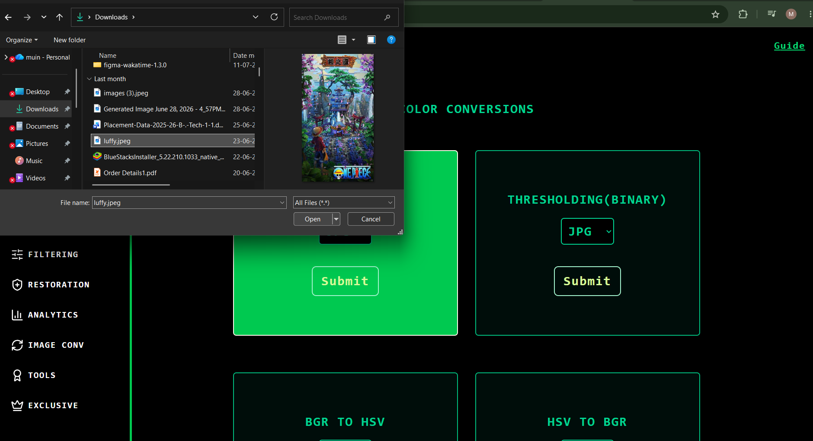
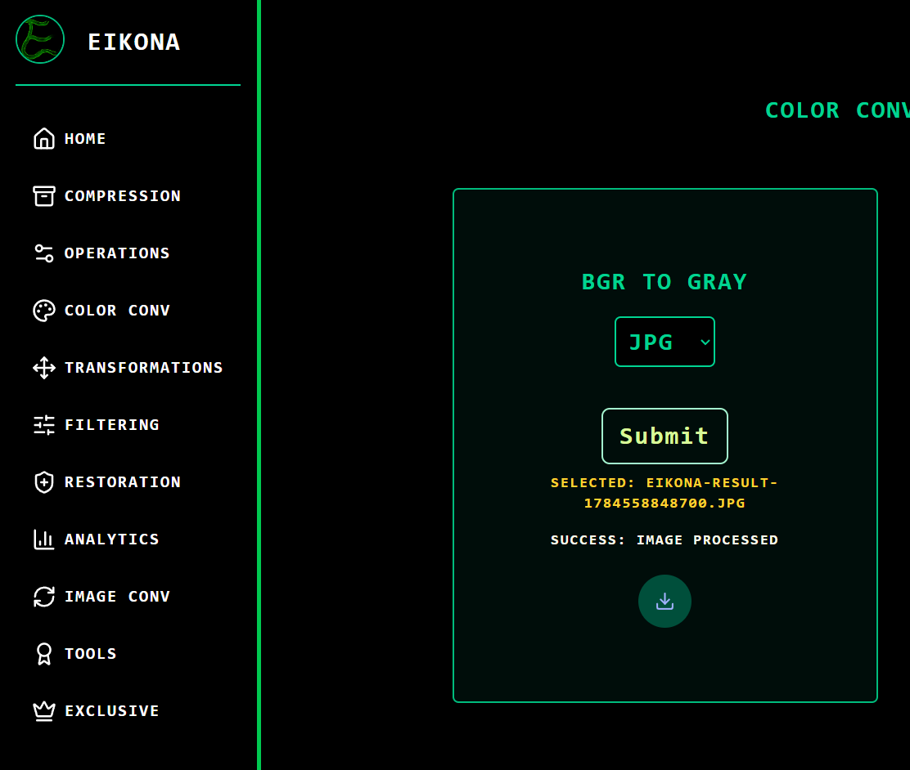
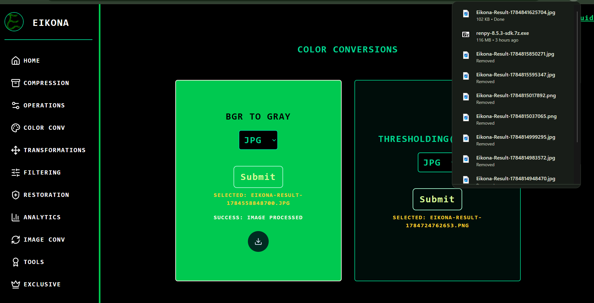

# EIKONA

Eikona is an Image-processing tool that contains more than 35 tools which are based on different perspectives.

Eikona is easy,simple and powerful Image processing tool.It's designed for beginners and experts that are learning and Adapting to Image processing.

---
## Features
- 35+ different Image processing tools.
- Demanding tools like Background Removal and Image compression.
- Preview of Resultant Image and Downloadable in different formats.
- User-guide and Support provided.
- Fast locally
---
## Screenshots
### Home Screen 

### Upload Image

### Checkout before Submit

### Submitting Image

### Processing Image

### Result Preview

### Download Result

---
## Installation
```bash
# Clone Repo
git clone "https://github.com/muin-15/eikona.git"
cd eikona

# Frontend
eikona/frontend_eikona/README.md

# Backend
eikona/backend_eikona/Readme.md
```
---
## Project Structure
```
eikona/
├── Testing/
├── backend_eikona/
│   ├─ main.py
│   └─ Readme.md
├── frontend_eikona/
│   ├─ index.html
│   ├─ src/
│   │  ├─ assets
│   │  ├─ index.css
│   │  ├─ App.tsx
│   │  ├─ main.tsx
│   │  └─ App.css
│   ├─ public/
│   │  ├─ user-guide.html
│   │  └─ userguide.css
│   └─ README.md
├─ .gitignore
├─ .gitattributes
├─ LICENSE
└─ README.md
```
---
## License
The project is under the [GPL 3.0 License](LICENSE)
---
Built with 💛 by [Muinashraf](https://github.com/muin-15)