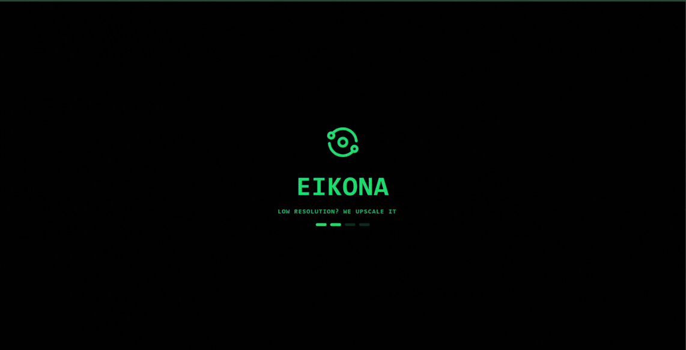

# Eikona

Eikona is an image processing website that have different operations like Image Addition,Background removal,Object detection,etc.

It is build using React, FastAPI and OpenCV.


---
## Features
- Image Compression.
- Background Removal.
- Object Detection.
- User guide
- Multiple Output Formats.
---
## Installation
```bash
#clone Repository
git clone "https://github.com/muin-15/eikona.git"
cd eikona
```

#setup frontend
```bash
cd eikona/frontend_eikona
npm install
npm run build

Update the backend url to use locally,most prolly,it's just localhost:8000
```

#setup for backend
```bash
cd eikona/backend_eikona

#activate venv according to OS
python -m venv venv
venv\Scripts\activate

# Install deps and run the server
pip install -r requirements.txt
uvicorn app.main:app --reload
```
---
## Use of AI
- Ai tools are used to deploy the project and troubleshoot.
---
## License
[GPL-3.0 License](LICENSE)