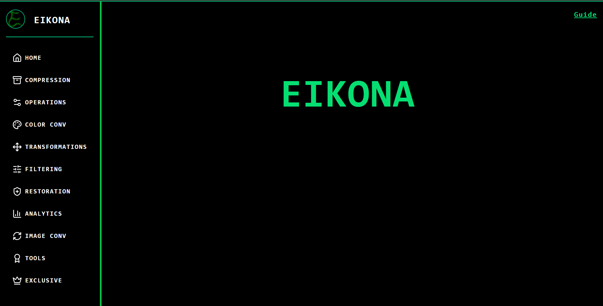
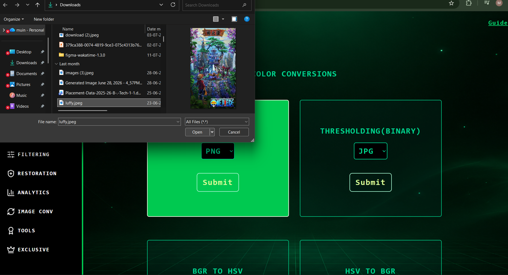
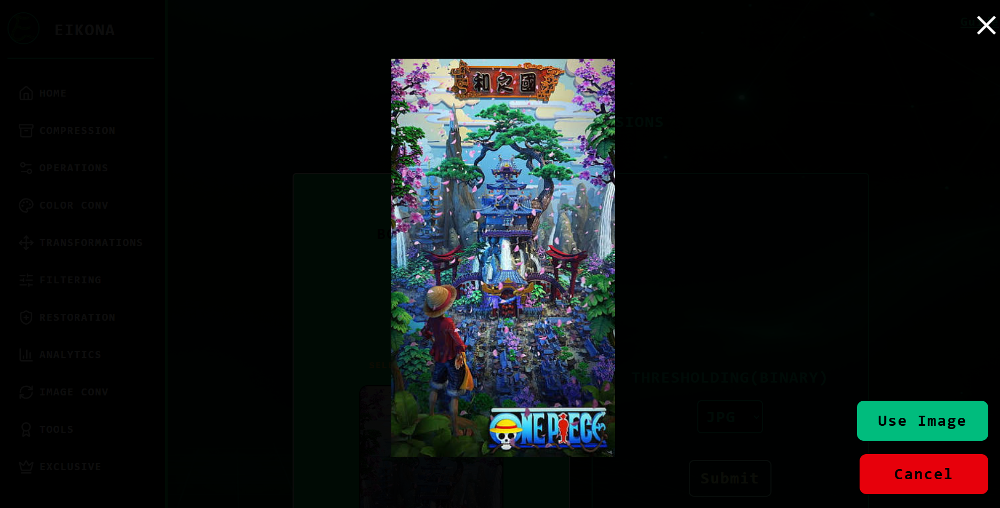
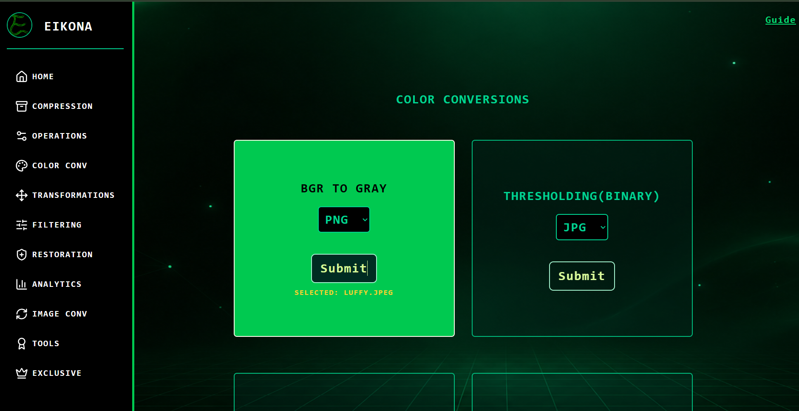
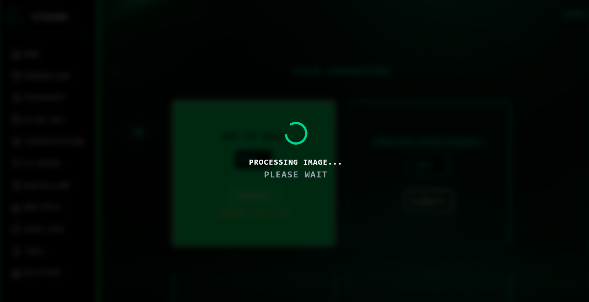
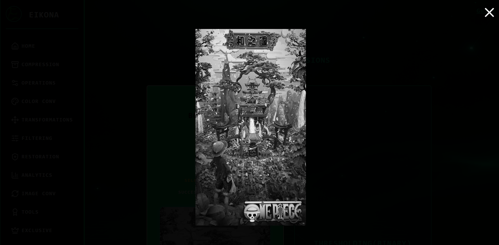
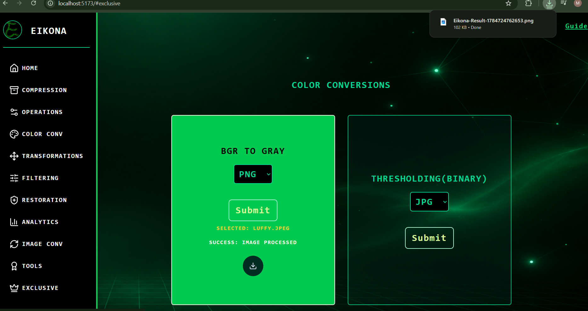

# **📸EIKONA**

## 🖌️Eikona - Advanced Image Processing Suite:-
**Eikona** is a **powerful web-based image processing** platform designed to make advanced ***image editing, enhancement, and computer vision techniques*** accessible through an intuitive interface. Built with modern technologies like FastAPI,React,TypeScript,Python,OpenCV providing high-performance image processing libraries, **Eikona** enables users to transform, analyze, and optimize images in real time.<br>

---


---

## 📖Overview
The platform offers a comprehensive set of tools including *image transformations, geometric operations, filtering, restoration, segmentation, object detection, and color analysis.* Users can apply effects such as ***scaling, rotation, filtering, image analysis, edge detection, image sharpening, and noise reduction*** with just a few clicks.
<br>
Beyond traditional image processing, **Eikona** integrates *AI-powered* features such as automatic <u>background removal</u>,<u> object detection, super-resolution</u>,<u> image enhancement</u>,and<u> dominant color extraction</u>.<br> These capabilities allow creators, students, developers, and researchers to perform complex image analysis without requiring specialized software or technical expertise.<br>

---

## ✨Features

### 🎨Color Conversion
- BGR ↔ RGB,
- BGR ↔ LAB,
- BGR ↔ HSV,
- BGR to Binary,
- BGR to Gray,

### 📉Image Compression
- Adjustable compression quality
- Optimized file size

### 🖼Transformations
- Negative transformation
- Power Law transformation
- Log transformation
- Rotation
- Upscaling
- Downscaling

### ⛑️Operations
- Image Addition
- Image Subtraction
- Image Multiplication
- Image Division

### 🔍Filtering
- Mean Filter
- Median Filter
- Gaussian Smoothing
- Laplacian Sharpening
- Bilateral Filtering

### 🦺Restoration
- Inverse Filtering
- Wiener Filtering

### 📊Analytics
- Histogram
- DCT
- DFT
- FFT

### 🔁Image Conversion
- Convert to different file formats:jpg,png,webp,bmp,tiff

### 🛠️Tools
- Background Removal
- Image INPAINT
- Stylization
- HDR Effect
- Pencil Sketch

### ✨Exclusive/AI Features
- Quality Enhancement
- Face Detection
- Object Detection
- Edge Detection

---

## Screenshots

### Home Screen


### Uploading Image


### Input Image


### Submitting Image


### Processing


### Result Image


### Downloading Image


---

## 🛠️Tech Stack

### Frontend
- HTML5
- React
- CSS3
- Tailwind CSS
- Vanilla JavaScript

### Backend
- FastAPI
- Python
- OpenCV
- Numpy
- Pillow
- Ultralytics YOLO
- Matplotlib
- YuNet

---

## Project Structure

```
eikona/
├── Testing/
├── backend_eikona/
│   ├── main.py
│   └── README.md
├── frontend_eikona/
│   ├── src/
│   │   ├── index.html
│   │   ├── main.tsx
│   │   ├── App.tsx
│   │   ├── index.css
│   │   └── App.css
│   ├── public/
│   │   ├── user-guide.html
│   │   └── user-guide.css
│   └── README.md
├── .gitattributes
├── .gitignore
├── LICENSE
└── Readme.md
```

---

## 🚀Getting Started

### Clone Repository
```bash
git clone https://github.com/muin-15/eikona.git
cd eikona
```

### Frontend
See:
```
frontend_eiokna/Readme.md
```
### Backend
See:
```
backend_eikona/Readme.md
```

---

## 📖Documentation
- 📘 User Guide: https://eikona-img-khaki.vercel.app/user-guide.html
- ⚙ Backend Documentation: https://github.com/muin-15/eikona/blob/main/backend_eikona/README.md
- 💻 Frontend Documentation: https://github.com/muin-15/eikona/blob/main/frontend_eikona/README.md

---

## 🌟Future Plans
- User Accounts
- Enhanced Image Restoration
- More AI-based Image Processing tools

---

## 🤝Suggestions
Suggestions and Bug reports are welcome.

---

## 📜License
This project is licensed under the GPL 3.0 License.

---

## 👨‍💻 Author

**Muinashraf Juber Momin**

Artificial Intelligence & Machine Learning Student

GitHub: https://github.com/muin-15